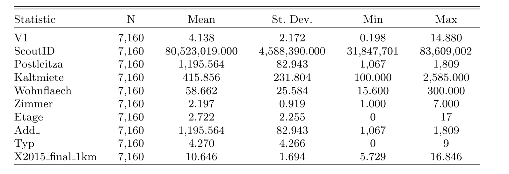
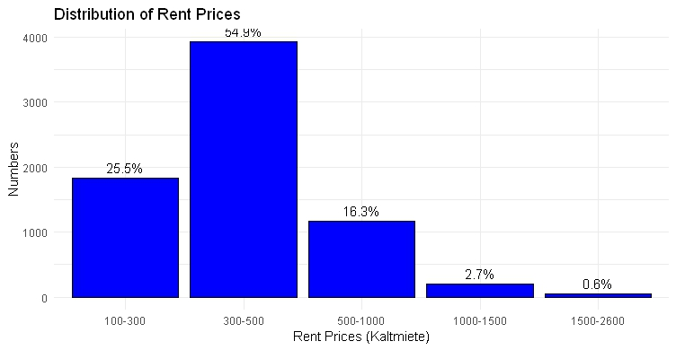
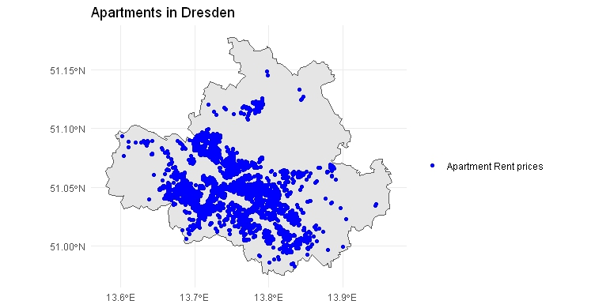
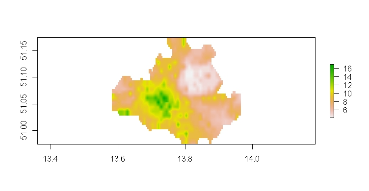

# Research Question

How NO2 emissions correlate with rental prices in urban apartments in Dresden?

##### 

## Sub-Question

-   Is there a relationship (correlational or causal) between NO2 pollution levels and rental prices?

-   How does proximity to the main train station influence rental prices?

-   What other factors, such as apartment size and others mediate the effect of air pollution on rental prices?

# Hypotesis

-   **Null Hypothesis (H0)** There is no significant relationship between NO2 emission and housing prices in Dresden, because of low level emission.

-   **Second Hypothesis (H1)** There is a nonlinear relationship between emission levels and property prices, suggesting that beyond a certain threshold, the impact of emissions on property prices accelerates.

# Data

After cleaning the data I filtered only to Dresden and 2015 years.

Here is the descriptive statistics of final data

-Kaltmiete = Rent prices

Postleitze= Post number

Wohnflaech= size of space

Zimmer= rooms

Etage= Position of floor

X2015_final_1km= NO2 emission

[{width="100%"}](Output/Descriptive statistic.png)

## Here is the distrubition of apartment rent price

you can see almost 55% of apartment prices located in 300-500 euro.

## The geospatial distrubition of apartments in Dresden

# Emission raster data

You can see the level of emissions in Dresden is very low, according to the literatures the low level lies from 0 to 40.

# Emission, city center and apartments of Dresden

I calculated the distance between HBF (main station) to every apartment and added to my apartment data as column. For this I used hbf \<- tibble::tribble code for adding the adress of HBF.

# Method

**1st Model (with all emission data as number)**

$\begin{align*} \log(\text{Rent prices}) = & \ \beta_0 + \beta_1 \log(\text{distance to city center}) + \beta_2 \log(\text{size of living space}) \\ & + \beta_3 (\text{pre-equipped with a kitchen}) + \beta_4 (\text{room}) + \beta_5 (\text{floor}) \\ & + \beta_6 (\text{Garden}) + \beta_7 (\text{Barrierefr}) + \beta_8 (\text{basement}) \\ & + \beta_9 (\text{Balkon}) + \beta_{10} (\text{Elevator}) + \beta_{11} \log(\text{NO}_2 \text{ emission}) + \epsilon \end{align*}$

**2nd Model ( with 2 emission levels according to the mean of NO2)**

$$
\begin{align*}\log(\text{Rent prices}) = & \ \beta_0 + \beta_1 \log(\text{distance to city center}) + \beta_2 \log(\text{size of living space}) \\& + \beta_3 (\text{pre-equipped with a kitchen}) + \beta_4 (\text{room}) + \beta_5 (\text{floor}) \\& + \beta_6 (\text{Garden}) + \beta_7 (\text{Barrierefr}) + \beta_8 (\text{basement}) \\& + \beta_9 (\text{Balkon}) + \beta_{10} (\text{Elevator}) + \beta_{11} (\text{NO}_2 \text{ category}) + \epsilon\end{align*}
$$

## Here is the distrubition of levels according to the mean that I seperated for examinig of regression.

# Result

.png)

My initial finding indicate that several independent variables, notably No2 ,significantly influence housing prices. You can see the main impacts on the rent prices 1st is avaibality of Barrier ( the avaiability of barrier free ) , Wohnflaech ( size of apartment) , EBK (Built in Kitchen) and NO2 emission had significanly effect on the rent prices of Dresden in 2015.

Similarly for the results in the second model which categorizes emissions, most of the independent variables are statistically significant and have impacts on the rental prices, but the impact is very small for groups of NO2.

One plausible explanation for these findings is that emission levels in Dresden are generally low, so as group it had minimal influences on the rental prices, but as number of NO2 had strong impact on the apartment rent prices.
